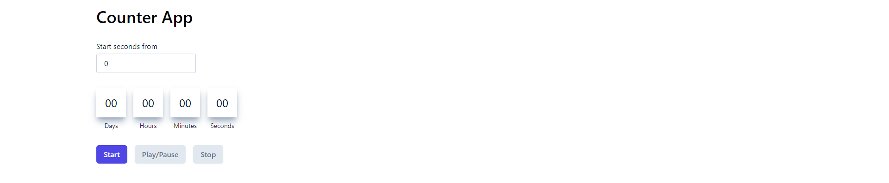
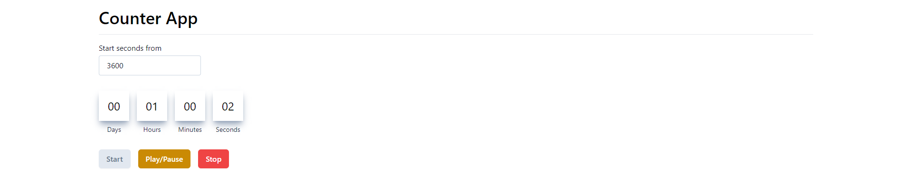

# Getting Started with Counter Application using Create React App

Live demo: [https://akashvichhi.github.io/react-counter/](https://akashvichhi.github.io/react-counter/)

This project was bootstrapped with [Create React App](https://github.com/facebook/create-react-app) TS template. The [Tailwind](https://tailwindui.com/) is used as UI library for the project.

## Available Scripts

In the project directory, you can run:

### `npm start`

Runs the app in the development mode.\
Open [http://localhost:3000](http://localhost:3000) to view it in the browser.

## Screenshot

